# Medicon - Clinical Encounter & Telehealth Management Platform

[](LICENSE)
[](https://github.com/kentrussel-dev/medicon-CS/tree/master)
[](https://php.net)
[](https://laravel.com)
[](https://vuejs.org)
[](https://fastapi.tiangolo.com)
[](https://tailwindcss.com)
[](LICENSE)

---

## What is Medicon?

Medicon is a full-stack clinical encounter and telehealth platform built for healthcare providers, outpatient clinics, and hospital networks. It bridges modern telemedicine consultations with institutional electronic medical record (EMR) workflows.


### Purpose & Problem Solved
Traditional clinic management systems frequently suffer from fragmented tooling: video calls occur in disconnected third-party apps, diagnostic notes are documented in outdated desktop software, and missed appointments lead to lost physician utilization and delayed patient care.

Medicon consolidates these workflows into a single HIPAA-conscious platform:
- **Integrated Telemedicine**: Conduct multi-party video consultations directly inside the portal without external software installations.
- **Pre-Join Green Room**: Test camera and microphone devices, check audio meters, and preview attendee presence before entering.
- **Structured Clinical Documentation**: Create standardized SOAP notes (Subjective, Objective, Assessment, Plan), record vital signs, and assign ICD-10 diagnostic codes during or after visits.
- **Electronic Prescriptions (e-Rx)**: Formulate multi-drug prescriptions with exact dosage, route, frequency, and refill instructions.
- **Predictive Attendance Triage**: Utilize a machine learning microservice to score patient no-show risks at the moment of booking, allowing clinical staff to perform targeted outreach before appointments occur.
- **Global Conversational AI Assistant**: 24/7 intelligent health assistant supporting guest navigators and authenticated clinicians alike.
- **Privacy & Security First**: Sensitive medical fields are encrypted with AES-256 at rest, all record access is immutably logged in HIPAA audit trails, and in-room consultation data is purged upon session termination.

---

## Application Showcase & UI Walkthrough

### 1. Hospital Landing Gateway & Instant Telehealth Launcher
*Public medical portal featuring specialist directory search, clinical leadership profiles, institutional news, inquiries contact form, and instant 3-part code telehealth launcher.*

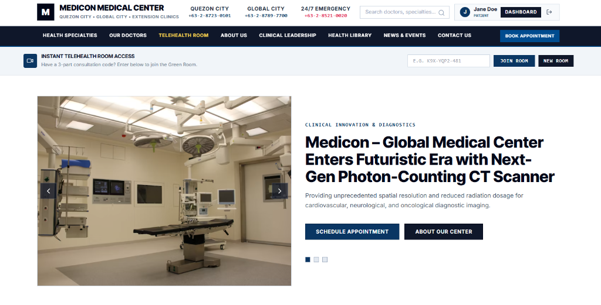

---

### 2. Clinical Authentication & Fast Role Switcher
*Institutional identity portal featuring 256-bit encryption at rest, secure session tokens, and 1-click credential auto-fill for testing Patient, Doctor, and Administrator roles.*

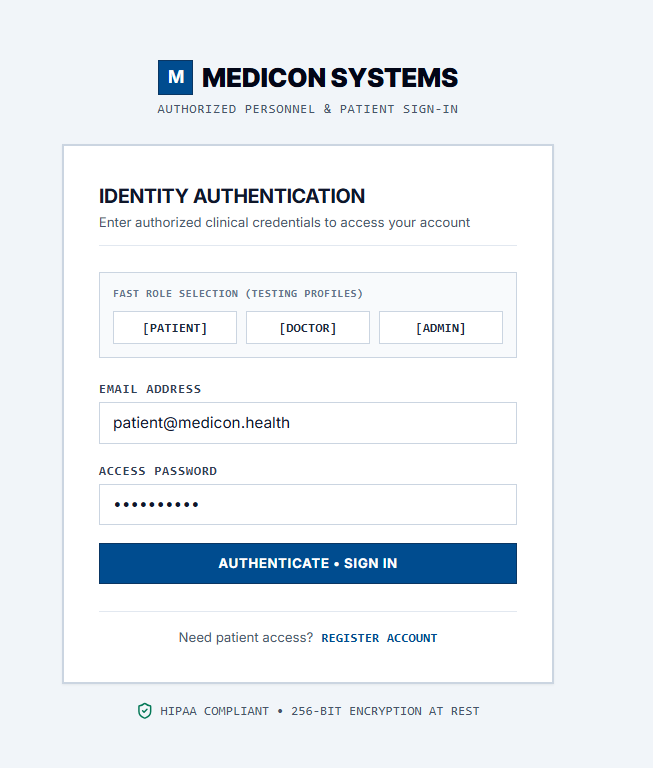

---

### 3. Patient Electronic Health Record & Dashboard
*Centralized health workspace featuring upcoming consultation schedules, active electronic prescriptions, past clinical encounter summaries, and 1-click video visit access.*

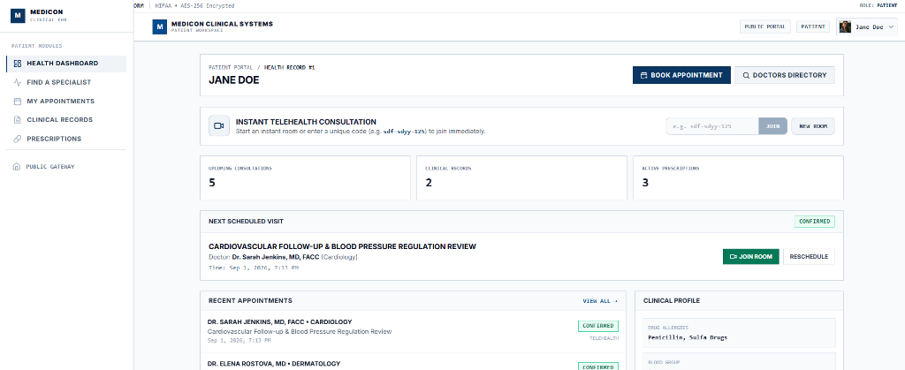

---

### 4. Pre-Consultation Green Room Waiting Lobby
*Google Meet-style pre-join lobby allowing patients and doctors to test camera/mic settings, verify audio meters, view case summaries, and check active participants before entering.*

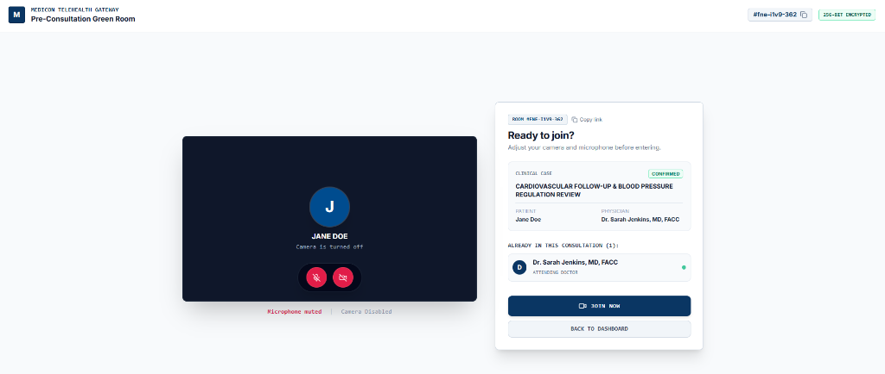

---

### 5. 1080p Encrypted WebRTC Telehealth Consultation Stage
*HD peer-to-peer clinical consultation stage featuring strict 16:9 widescreen video grids, in-call encrypted chat, SOAP charting, vital signs telemetry, and instant data purge upon room closure.*

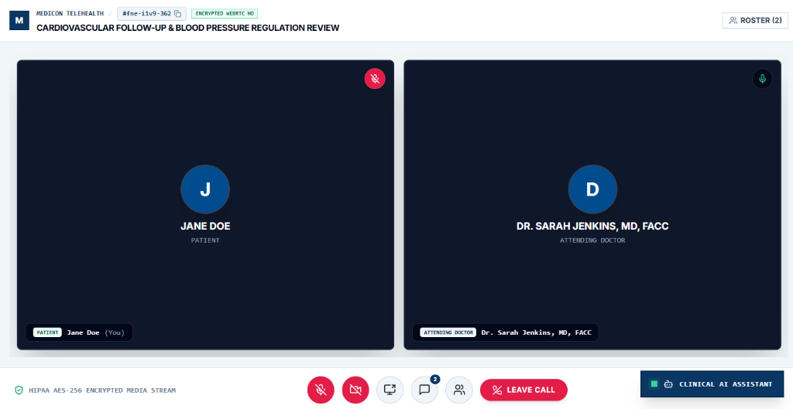

---

### 6. Clinical AI Assistant & Patient Health Navigator
*24/7 conversational clinical co-pilot capable of answering health inquiries, looking up upcoming appointments, explaining prescriptions, and assisting guests and authenticated patients.*

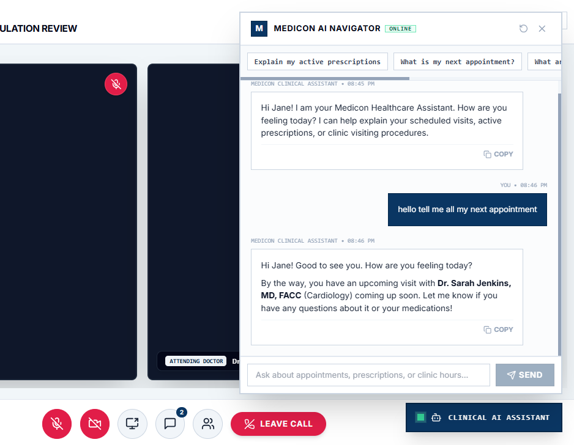

---

### 7. In-Call Encrypted Messaging & Multi-Specialist Chat
*Real-time peer-to-peer encrypted messaging drawer inside the consultation room for sharing clinical notes, diagnostic updates, and specialist coordination.*

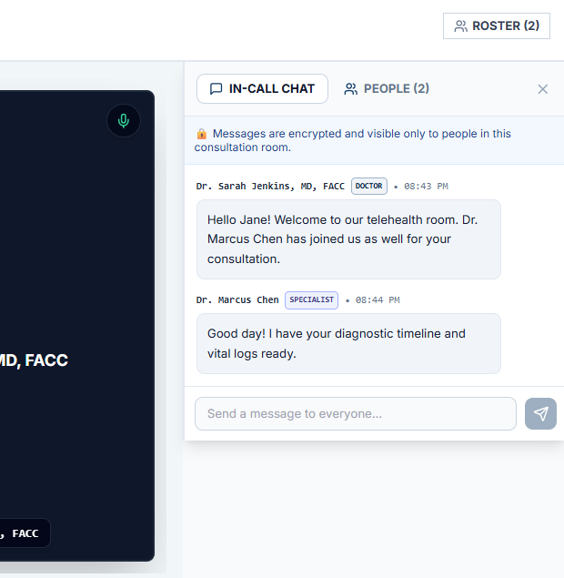

---

### 8. Encrypted Clinical Records & ICD-10 Diagnostic Summaries
*HIPAA-compliant patient medical chart displaying documented diagnoses (ICD-10), vital signs matrices (BP, HR, SpO2), attending clinician notes, and AES-256 encryption at rest.*

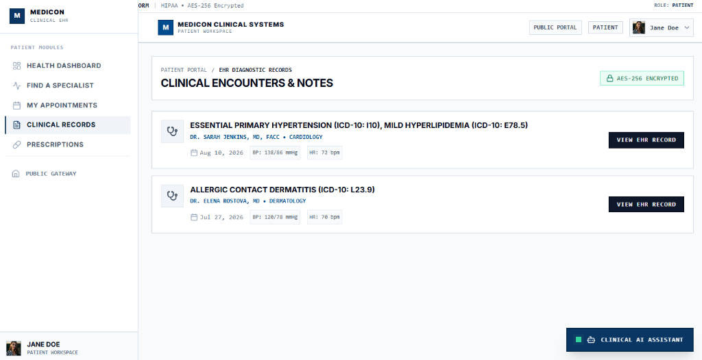

---

### 9. Authorized Electronic Prescriptions (e-Rx) Management
*Structured multi-drug medication orders with exact dosage, route, frequency, refills tracking, and direct consultation linkage.*

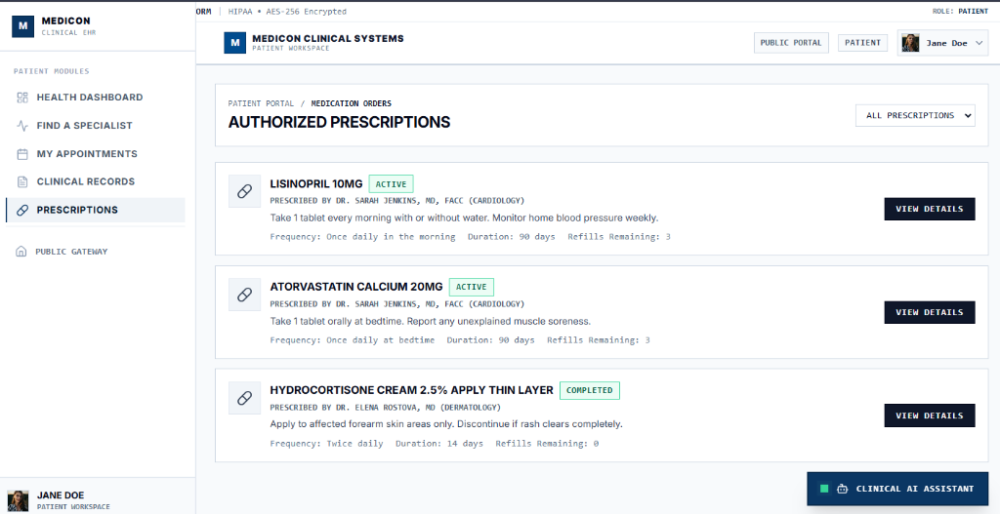

---

## System Architecture Diagram

> [!TIP]
> **Interactive Zoom**: GitHub natively renders the Mermaid diagram below. Click the diagram on GitHub to open fullscreen view with pan and zoom capabilities.

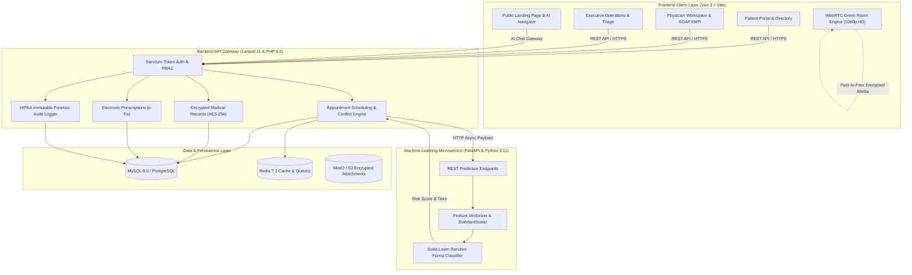

---

## Telehealth Consultation Protocol & Green Room

```mermaid
graph LR
    subgraph Stage1["Step 1: Pre-Join Green Room Lobby"]
        A1["Enter Room via Code (#k9x-yqp2-481)"] --> A2["Camera & Mic Self-Check (Default: Muted/Off)"]
        A2 --> A3["Check Attendee Presence Preview"]
        A3 --> A4["Click 'Join Now'"]
    end

    subgraph Stage2["Step 2: 1080p WebRTC Consultation"]
        B1["16:9 Widescreen Video Grid"] --> B2["Real-Time SOAP Charting & Vitals"]
        B2 --> B3["Screen Sharing & Diagnostics Spotlight"]
        B3 --> B4["Multi-Specialist Secondary Invite"]
    end

    subgraph Stage3["Step 3: Consultation End & Purge"]
        C1["Formulate Electronic Prescription (e-Rx)"] --> C2["Finalize Encounter Diagnostic Note"]
        C2 --> C3["End Call for Everyone"]
        C3 --> C4["Permanent Ephemeral Chat & Token Purge"]
    end

    A4 --> B1
    B4 --> C1
```

### Telehealth Workflow Stages:
1. **Pre-Join Green Room Lobby**:
   - Live 16:9 mirror self-check preview with floating circular mic/camera toggles.
   - Microphone and camera start muted/off by default for patient privacy.
   - Clinical consultation case summary with unique 3-part consultation code (e.g. `#k9x-yqp2-481`).
   - Real-time attendance list displaying participants already in the consultation with empty-room notice if you are first.
2. **1080p Encrypted Video Visit**:
   - Strict 16:9 widescreen video stage supporting 1, 2, 3 (centered pyramid), and 4+ participant grids.
   - Multi-party capabilities: Doctors can invite secondary specialists or medical interpreters.
   - Screen sharing with 80% spotlight stage.
3. **Session Closure & Ephemeral Data Purge**:
   - Instant chat messages and ephemeral media tokens are permanently wiped from the database upon consultation closure.

---

## Machine Learning Attendance Risk Pipeline

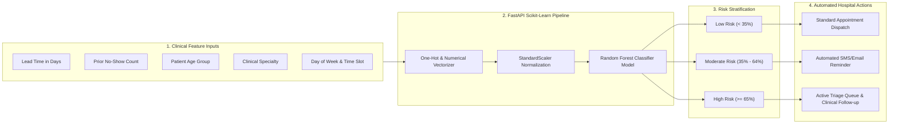

### Predictive Triage Architecture:
1. **Clinical Feature Inputs**: Lead time (days), prior no-show frequency, age group, appointment specialty, day of week, and time slot.
2. **FastAPI Scikit-Learn Pipeline**: Feature vectorizer, StandardScaler normalization, and Random Forest classification.
3. **Risk Stratification Tiers**:
   - **Low Risk (<35%)**: Standard appointment processing.
   - **Moderate Risk (35% - 64%)**: Standard reminder queue.
   - **High Risk (>=65%)**: Flagged in Active Triage Queue for targeted confirmation calls and overbooking adjustments.
4. **Automated Clinical Actions**: Real-time triage dashboards for Chief Medical Officers and Clinic Administrators.

---

## Database Relational Entity-Relationship Diagram (ERD)

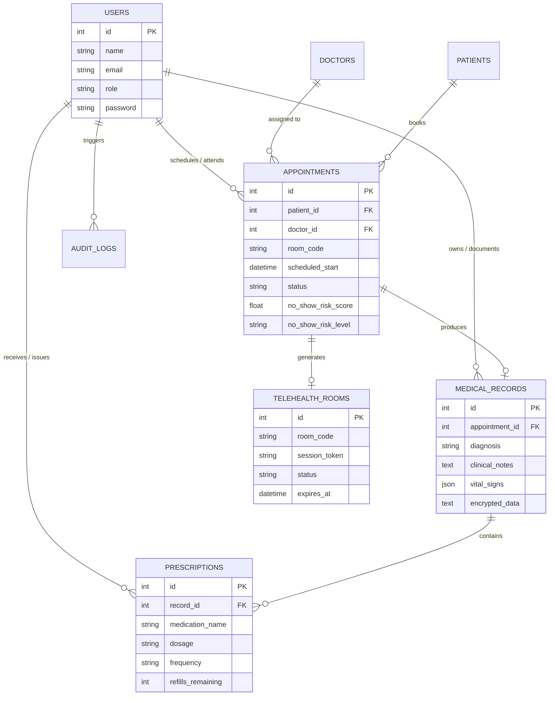

---

## Core Capabilities by Role

### 1. Patient Portal
- Browse credentialed physicians filtered by medical specialty, experience, and fees.
- Schedule, reschedule, or cancel telehealth and in-person consultations.
- Enter the Google Meet-style Green Room waiting lobby to preview and verify camera/microphone settings before joining.
- Access encrypted personal medical history, diagnosis records, and electronic prescriptions.
- Join ad-hoc instant rooms using 3-part random consultation codes.

### 2. Attending Physician Portal
- Configure weekly availability schedules and flexible consultation durations (15, 30, 45, or 60 minutes).
- Manage patient appointments with attendance status tracking (Confirmed, In-Progress, Completed, Cancelled, No-Show).
- Host multi-party WebRTC consultations with strict 16:9 widescreen video grids, screen sharing (spotlight mode), and in-call encrypted chat.
- Document clinical encounters with structured SOAP notes, ICD-10 codes, and vitals matrices (BP, HR, SpO2, Temp, Weight).
- Formulate electronic prescriptions and review patient medical histories.

### 3. Chief Medical Officer / Administrator Portal
- High-level executive dashboard tracking total patients, active doctors, appointment volume, and clinic revenue.
- Machine Learning Attendance Triage Center displaying flagged high-risk appointments (>= 65% risk score) with contributing risk factors.
- Clinic-wide physician productivity and room utilization analytics.
- User and staff directory management with activation toggles.
- Immutable HIPAA forensic audit trail detailing all record views, edits, and downloads.

---

## Tech Stack Overview

- **Frontend**: Vue 3 (Composition API, `<script setup>`), Vite 6, Tailwind CSS 3.4, Pinia 2 (State Management), Vue Router 4, Lucide Icons.
- **Backend REST API**: Laravel 11 (PHP 8.2), Laravel Sanctum Authentication, Eloquent ORM with Encrypted Casts, Form Requests, Policies, and Seeders.
- **Machine Learning Service**: Python 3.11, FastAPI, Scikit-Learn (Random Forest & Gradient Boosting Classifiers), Pydantic v2, Uvicorn.
- **Database & Cache**: MySQL 8.0 (Primary Storage), Redis 7.2 (Sessions, Cache, Queues).
- **Object Storage**: S3-compatible storage (MinIO) for encrypted medical attachments.
- **Deployment**: Docker, Docker Compose, Multi-stage production builds.

---

## Step-by-Step Setup Guide

You can run Medicon using either Docker (recommended for a full-stack experience) or Local Development (step-by-step per service).

---

### Method A: Quick Start with Docker (Recommended)

#### Prerequisites
- Docker Engine 24.0+ ([Install Docker](https://docs.docker.com/engine/install/))
- Docker Compose v2.0+

#### Step 1: Clone the Repository (Master Branch)
```bash
git clone -b master https://github.com/kentrussel-dev/medicon-CS.git
cd medicon-CS
```

#### Step 2: Configure Environment Files
Copy the template configuration files:
```bash
cp backend/.env.example backend/.env
cp frontend/.env.example frontend/.env
cp ml-service/.env.example ml-service/.env
```

#### Step 3: Start the Multi-Container Stack
```bash
docker compose up -d --build
```

#### Step 4: Run Migrations and Seed Clinical Data
```bash
docker compose exec backend php artisan migrate --seed
```

#### Step 5: Access the Services
- Frontend Web Portal: `http://localhost:5173`
- REST API Gateway: `http://localhost:8080/api`
- FastAPI ML Service Documentation: `http://localhost:8000/docs`
- MinIO Object Storage Console: `http://localhost:9001` (User: `minioadmin`, Pass: `minioadmin`)

---

### Method B: Local Development Setup (Manual)

#### Prerequisites
- **Node.js**: v18.0 or higher (`npm` v9+)
- **PHP**: v8.2 or higher with extensions: `pdo_mysql`, `mbstring`, `openssl`, `bcmath`, `curl`
- **Composer**: v2.0+
- **Python**: v3.10 or v3.11 with `pip`
- **MySQL**: v8.0+ running locally on port 3306

---

#### Step 1: Setup the Backend API (Laravel 11)

1. Navigate to the backend directory:
   ```bash
   cd backend
   ```

2. Install PHP dependencies:
   ```bash
   composer install
   ```

3. Configure your `.env` file:
   ```bash
   cp .env.example .env
   ```
   Ensure your database credentials in `backend/.env` match your local MySQL server:
   ```env
   DB_CONNECTION=mysql
   DB_HOST=127.0.0.1
   DB_PORT=3306
   DB_DATABASE=medicon_db
   DB_USERNAME=root
   DB_PASSWORD=your_mysql_password
   ```

4. Generate application key:
   ```bash
   php artisan key:generate
   ```

5. Run database schema migrations and seed clinical datasets:
   ```bash
   php artisan migrate --seed
   ```

6. Start the Laravel backend server:
   ```bash
   php artisan serve --port=8080
   ```
   The backend API will run on `http://localhost:8080`.

---

#### Step 2: Setup the Machine Learning Microservice (FastAPI)

1. Open a new terminal and navigate to `ml-service`:
   ```bash
   cd ml-service
   ```

2. Create and activate a Python virtual environment:
   - On Windows (PowerShell):
     ```powershell
     python -m venv venv
     .\venv\Scripts\Activate.ps1
     ```
   - On Linux / macOS:
     ```bash
     python3 -m venv venv
     source venv/bin/activate
     ```

3. Install Python dependencies:
   ```bash
   pip install -r requirements.txt
   ```

4. Train and serialize the initial no-show prediction model:
   ```bash
   python train.py
   ```

5. Start the FastAPI development server:
   ```bash
   uvicorn app.main:app --host 0.0.0.0 --port 8000 --reload
   ```
   The ML service will run on `http://localhost:8000` (Interactive Swagger docs available at `http://localhost:8000/docs`).

---

#### Step 3: Setup the Frontend Application (Vue 3 + Vite)

1. Open a third terminal and navigate to `frontend`:
   ```bash
   cd frontend
   ```

2. Install Node dependencies:
   ```bash
   npm install
   ```

3. Configure frontend environment:
   ```bash
   cp .env.example .env
   ```

4. Launch the Vite development server:
   ```bash
   npm run dev
   ```
   The web application will be live at: `http://localhost:5173`.

---

## Seeded Clinical Accounts & Credentials

The application is pre-seeded with realistic clinical accounts for all roles:

| Role | Name / Title | Specialty / Focus | Email | Password |
|---|---|---|---|---|
| Admin | Dr. Eleanor Vance, MD | Chief Medical Officer | `admin@medicon.health` | `Secret123!` |
| Doctor | Dr. Sarah Jenkins, MD, FACC | Cardiology | `sarah.jenkins@medicon.health` | `Secret123!` |
| Doctor | Dr. Marcus Chen, MD, PhD | Neurology | `marcus.chen@medicon.health` | `Secret123!` |
| Doctor | Dr. Elena Rostova, MD | Dermatology | `elena.rostova@medicon.health` | `Secret123!` |
| Doctor | Dr. James Wilson, MD | General Practice | `james.wilson@medicon.health` | `Secret123!` |
| Doctor | Dr. Aisha Patel, MD | Psychiatry | `aisha.patel@medicon.health` | `Secret123!` |
| Doctor | Dr. Robert Taylor, MD | Orthopedics | `robert.taylor@medicon.health` | `Secret123!` |
| Patient | Jane Doe | Hypertension / Wellness | `patient@medicon.health` | `Secret123!` |
| Patient | John Miller | Post-Op Orthopedics | `john.miller@medicon.health` | `Secret123!` |
| Patient | Emily Clark | Chronic Migraine | `emily.clark@medicon.health` | `Secret123!` |

*(The login screen also features 1-click role auto-fill buttons for quick testing).*

---

## Testing & Quality Assurance

### 1. Run Backend Automated Tests (PHPUnit)
```bash
cd backend
php artisan test
```
Test suites include:
- `AppointmentBookingConflictTest`: Validates slot collision prevention and doctor operating hours.
- `RoleBasedAccessControlTest`: Ensures strict endpoint authorization across Patient, Doctor, and Admin roles.
- `EncryptedMedicalRecordTest`: Verifies raw database ciphertext persistence and transparent Eloquent decryption.
- `ImmutableAuditLogTest`: Confirms append-only audit trail integrity and mutation blocking.
- `NoShowPredictionServiceTest`: Tests ML client communication and heuristic fallback behavior.

### 2. Run Machine Learning Microservice Tests (Pytest)
```bash
cd ml-service
pytest tests/ -v
```
Verifies single predictions, batch triage, input validation schemas, and API health endpoints.

### 3. Build & Type Check Frontend (Vite)
```bash
cd frontend
npm run build
```

---

## Project Structure

```
medicon/
├── backend/                  # Laravel 11 REST API
│   ├── app/
│   │   ├── Enums/            # PHP 8.2 Enumerations (UserRole, RiskLevel, etc.)
│   │   ├── Http/Controllers/ # REST Resource Controllers (Telehealth, Records, etc.)
│   │   ├── Http/Requests/    # Form Request Validations
│   │   ├── Http/Resources/   # JSON Output Resources
│   │   ├── Models/           # Eloquent Models with Encrypted Casts
│   │   ├── Policies/         # HIPAA Authorization Policies
│   │   └── Services/         # ML Client, Audit Service, Storage Services
│   ├── database/migrations/  # Database Migrations (13 tables + Telehealth rooms)
│   ├── database/seeders/     # Clinical Demo Datasets
│   └── tests/                # PHPUnit Test Suite
│
├── frontend/                 # Vue 3 SPA
│   ├── src/
│   │   ├── components/       # UI Modals, Badges, Header & Navigation
│   │   ├── layouts/          # AppLayout & AuthLayout with page transitions
│   │   ├── router/           # Navigation Guards & RBAC Routes
│   │   ├── stores/           # Pinia State Stores (Auth, Appointments, Records, etc.)
│   │   ├── views/            # TelehealthRoomView, Doctor, Patient, & Admin Views
│   │   └── services/         # API Client & Mock Clinical Adapter
│   └── vite.config.js
│
├── ml-service/               # Python 3.11 FastAPI Microservice
│   ├── app/                  # REST Predictors & Pydantic Validation
│   ├── models/               # Serialized GradientBoosting Classifier
│   ├── tests/                # Pytest Test Suite
│   └── train.py              # ML Training & Evaluation Pipeline
│
├── docs/                     # Architecture & Technical Specifications
│   └── screenshots/          # Application UI & Clinical Workflow Previews
├── docker/                   # Hardened Nginx & PHP Container Configs
├── .gitignore                # Strict Git Exclusion Policy
└── docker-compose.yml        # Multi-Container Development Orchestration
```

---

## License

This project is licensed under the [MIT License](LICENSE).
